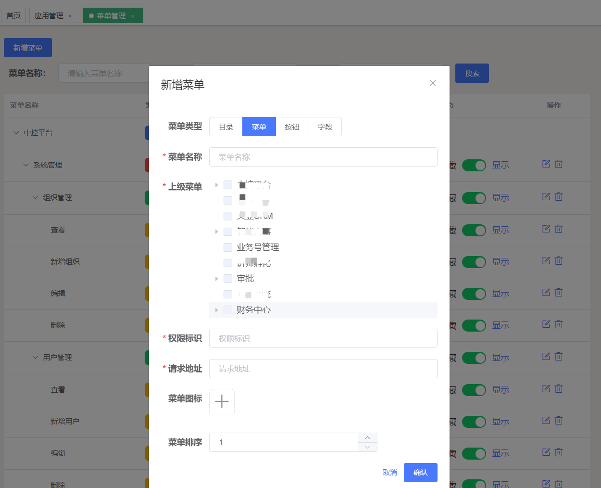
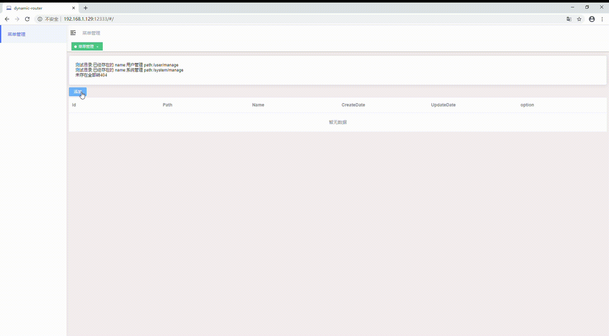

# dynamic-router

> 动态路由
>
> 由于公司业务需要，在权限验证与安全方面，要求是菜单根据权限动态控制。
>
> 在现有的项目当中，通过基于 **vue-element-admin** 项目提供的菜单权限控制，无法满足公司的具体业务需要。
>
> 实际上主要的目的是通过后端控制菜单权限。
>
> 因此也迭代出了两个版本，**版本二**也只是提供一个设计思路，具体复杂实现基于此套是是可以满足的。这里只做简单的阐述，具体实现可以结合源码。

- 版本一

  在公司项目**【用户中心】**中，我采用的是通过后端菜单列表以及权限标识，做深度递归和匹配。这么写一部分原因是因为是在现有的接口文档基础之上做 **魔改**，第二点也是因为代码耦合度比较高，重构的话周期长（前后端都需要改，前端工作量会很大）。

  #### Interceptor

  ```javascript
  router.beforeEach(async (to, from, next) => {
    NProgress.start();
    if (getToken()) {
      if (to.path === RouterPath.LOGIN) {
        next({ path: RouterPath.HOME });
        NProgress.done();
      } else {
        try {
          if (!store.getters.routerLoadDone) {
            const { isAdmin } = await store.dispatch("getUserInfo");
            const accessRoutes = await store.dispatch("generateRoutes", isAdmin);
            router.addRoutes(accessRoutes);
            let query = to.query;
            query.token = getToken();
            next({ ...to, replace: true, query });
          } else {
            ...
            } else next();
          }
        } catch (error) {
          ...
          NProgress.done();
        }
      }
    } else {
      if (whiteList.includes(to.path)) {
        next();
      } else {
        next(RouterPath.LOGIN);
        NProgress.done();
      }
    }
  });
  ```

  #### Vuex

  ```javascript
  actions: {
      ...
      async generateRoutes({ commit }) {
        const { body, status } = await getUserMenuAndPermission({
          appId: +AppId,
        });
        if (status === 200) {
          const { menus, permissions } = body;
          commit("SET_ROLES", permissions);
          const accessedRoutes = LoadMenus(menus, asyncRoutes);
          // isAdmin
          //   ? matchMenuResource(menus, asyncRoutes)
          //   : LoadMenus(menus, asyncRoutes);
          commit("SET_ROUTES", accessedRoutes);
          return accessedRoutes;
        }
        commit("SET_ROUTES", []);
        return [];
      },
  },
  ```

  #### Utils/Menus

  ```javascript
  import { MenuType, MenuStatus } from "@/utils/Enum/Menu";
  import _ from "lodash";

  /* 白名单 */
  const whiteList = ["404"];

  /**
   * 根据权限 加载菜单
   * @param {Array} assessedMenus 权限菜单
   * @param {Array} asyncRoutes 预加载菜单
   */
  export function LoadMenus(assessedMenus, asyncRoutes) {
    const { CATALOG } = MenuType;
    const { ENABLE } = MenuStatus;

    /** 先预加载 需要添加的菜单 */
    let menuCache = {},
      childCache = {};
    asyncRoutes.forEach((item) => {
      const { meta, children } = item;
      /* 目录 */
      if (meta) menuCache[meta.title] = item;
      /* 菜单 */
      if (children) childsForMap(childCache, children, meta.title);
    });

    /* 需要加载的目录 */
    let resultArray = [];

    assessedMenus
      .sort((a, b) => a.orderNo - b.orderNo)
      .forEach((item) => {
        const { menuType, menuPerms, menuIcon, subMenus, status } = item;
        /* 目录 */
        if (
          +menuType === CATALOG &&
          +status === ENABLE &&
          menuCache[menuPerms]
        ) {
          menuCache[menuPerms].children = [];
          menuCache[menuPerms].children = getChildMenus(
            subMenus,
            childCache,
            menuPerms
          );
          /* 添加 menuIcon */
          menuCache[menuPerms].menuIcon = menuIcon;
          resultArray.push(menuCache[menuPerms]);
        }
      });

    /* 添加白名单 */
    whiteList.forEach((white) => {
      if (menuCache[white]) resultArray.push(menuCache[white]);
    });

    return resultArray;
  }

  /**
   * 获取子菜单列表
   * @param {Array} subMenus 权限子菜单
   * @param {Object} asyncChildMap 预加载子菜单 Map
   * @param {String} pCode 父级权限标识
   */
  function getChildMenus(subMenus, childCache, pCode) {
    const { MENU } = MenuType;
    const { ENABLE } = MenuStatus;

    /* 子菜单集合 */
    let arr = [];
    subMenus
      .sort((a, b) => a.orderNo - b.orderNo)
      .forEach((item) => {
        const { menuPerms, menuType, menuIcon, status } = item;
        const _childMenu = childCache[menuPerms];
        if (+menuType === MENU && +status === ENABLE && _childMenu) {
          /* 添加 menuIcon */
          childCache[menuPerms].menuIcon = menuIcon;
          arr.push(childCache[menuPerms]);
        }
      });
    /* 添加 hidden页面 */
    if (childCache[pCode] && childCache[pCode].length > 0)
      arr.push(...childCache[pCode]);
    return arr;
  }

  /**
   * 子集菜单 做Map
   * @param {Object} cache 子集菜单hMap
   * @param {Array} childs 预处理子集列表
   * @param {String} pCode 父级权限标识
   */
  function childsForMap(cache, childs, pCode) {
    cache[pCode] = [];
    childs.forEach((item) => {
      const { hidden, meta } = item;
      /* 添加隐藏页 */
      if (hidden) {
        cache[pCode].push(item);
      } else cache[meta.title] = item;
    });
  }

  /* >>>>>>>>>>>>>>>>>>>>>>>>>>>>>>>>>>>>>>>>>>>>>>>>>>>>>>>>>>>>>>>>>> */

  /**
   * 为解决菜单渲染时，替换权限菜单有效信息：menuIcon
   * @param {Array} assessedMenus 权限菜单
   * @param {Array} asyncRoutes 预加载菜单
   */
  export function matchMenuResource(assessedMenus, asyncRoutes) {
    /** 资源菜单 to Map */
    let menuCache = {};

    const { ENABLE } = MenuStatus;
    assessedMenus.forEach(({ menuPerms, menuIcon, subMenus, status }) => {
      /* 启用状态 */
      if (+status === ENABLE) {
        /* 目录 cache */
        if (menuIcon) menuCache[menuPerms] = { menuIcon };
        /* 菜单 cache */
        if (_.isArray(subMenus)) cacheSubMenus(subMenus, menuCache);
      }
    });

    /** Router菜单 */
    asyncRoutes.forEach((item) => {
      const { meta, children } = item;
      /* 目录 */
      if (meta && menuCache[meta.title])
        item.menuIcon = menuCache[meta.title].menuIcon;
      /* 菜单 */
      if (children) matchChildMenus(children, menuCache);
    });
    return asyncRoutes;
  }

  /**
   * 缓存菜单
   * @param {Array} subMenus 菜单列表
   * @param {Object} menuCache 资源菜单Map
   */
  function cacheSubMenus(subMenus, menuCache) {
    const { ENABLE } = MenuStatus;
    subMenus.forEach(({ menuPerms, menuIcon, status }) => {
      if (+status === ENABLE) {
        if (menuIcon) menuCache[menuPerms] = { menuIcon };
      }
    });
  }

  /**
   * 匹配菜单
   * @param {Array} children 菜单列表
   * @param {Object} menuCache 资源菜单Map
   */
  function matchChildMenus(children, menuCache) {
    children.forEach((item) => {
      const { meta } = item;
      if (meta && menuCache[meta.title])
        item.menuIcon = menuCache[meta.title].menuIcon;
    });
  }
  ```

- 版本二

  网上的博客分享的第二种解决方案

  附上链接 [https://segmentfault.com/a/1190000021900731](https://segmentfault.com/a/1190000021900731)

  链接 2 [https://www.jianshu.com/p/ceef589de5e9](https://www.jianshu.com/p/ceef589de5e9)

  这两篇博客的文档大致看了一下，思路是一样的，原理实际上就是把 **Vue-Router** 里面的配置文件全部放到后端做 **Json** 存储。特殊字段如：**components**，在取出的同时动态 **require**。

  但如果结合公司业务，在**【用户中心】**项目下的**菜单管理**页面，手动添加 **目录、菜单、icon、path** 这种方式用起来感觉还是不太友好。

  

  版本二我设计的思路是动静分离，Router 文件的固定格式不变，具体的名称、路径做拆分，分别存到前端和后端。具体实现方式如下文。

#### 项目地址

[Gitee](https://gitee.com/g0ngjie/dynamic-router)
[Github](https://github.com/g0ngjie/dynamic-router)

> **前端：** 基于 vue-element-admin 延用公司 【用户中心】那一套自己魔改的版本，在此基础之上重构。
>
> **后端：** **Go**的语法简洁，开发速度快，所以后端使用了**Go**结合**Gin**框架，做了一个简单的**CURD**服务。（主要是因为没人手协助，也只好自己写一个了。）这里不过多介绍后端。

#### 动态路由

> 附上源码
>
> 我的思路是需要权限控制的菜单分成三部分：

1. **MenuMap** 做视图组件

   ```javascript
   export default {
     "/user/manage": () => import("@/views/user/index"),
     "/system/manage": () => import("@/views/system/index"),
   };
   ```

2. **RouterJson** 做工厂函数

   ```javascript
   /**
    * 生成路由json
    */
   function getRouterJson(headPath, childPath, menuName, component) {
     return {
       path: headPath,
       name: "",
       component: Layout,
       meta: {
         title: "",
         //   icon: "",
       },
       children: [
         {
           path: childPath,
           name: headPath + childPath,
           component: component,
           meta: {
             title: menuName,
             //   icon: "",
           },
         },
       ],
     };
   }

   /**
    * 404页面
    */
   function notFound() {
     return {
       path: "*",
       redirect: "/404",
       meta: { title: "404" },
       hidden: true,
     };
   }
   ```

3. 动静分离

   > 通过 **Interceptor** 调用后端接口获取 `path、name、icon等`权限菜单列表
   >
   > 结合 Vuex 下 **generateRoutes** 函数组装路由。

   ```javascript
   import Layout from "@/layout/index.vue";
   import menuData from "@/router/menu";

   ...
   ...

   /**
    * 拆分path
    * @param {string} path
    */
   function splitPath(path) {
     const list = path.split("/");
     let headPath = `/${list[1]}`;
     let childPath = "";
     list.forEach((item, index) => {
       if (index > 1) {
         childPath += `/${item}`;
       }
     });
     return { headPath, childPath: childPath.substr(1, childPath.length - 1) };
   }

   /**
    * 根据权限 加载菜单
    * @param {Array} assessedMenus 权限菜单
    * @param {Array} asyncRoutes 预加载菜单
    */
   export function LoadMenus(assessedMenus) {
     let resultArray = [];
     assessedMenus.forEach((item) => {
       const { name, path } = item;
       const { headPath, childPath } = splitPath(item.path);
       if (menuData[path]) {
         resultArray.push(
           getRouterJson(headPath, childPath, name, menuData[path])
         );
       } else {
         resultArray.push(
           getRouterJson(headPath, childPath, item.name, () =>
             import("@/views/404/index")
           )
         );
       }
     });

     resultArray.push(notFound());
     return resultArray;
   }
   ```

#### 效果展示


